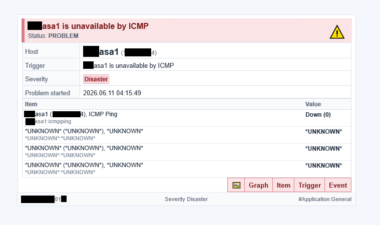

# Zabbix E-mail Templates for MS Outlook

HTML e-mail notification templates for Zabbix **7.4.x**.

Current version: **v26**

## Examples

### Chrome rendering

1. Warning

   

2. High

   

3. Resolved

   

> Real messages in MS Outlook look better than browser previews.

### MS Outlook / Office 365 rendering

1. Disaster

   

## TODO

- Switch to a custom Python + Jinja2 script.
- Remove extra fields with `*UNKNOWN*` records.
